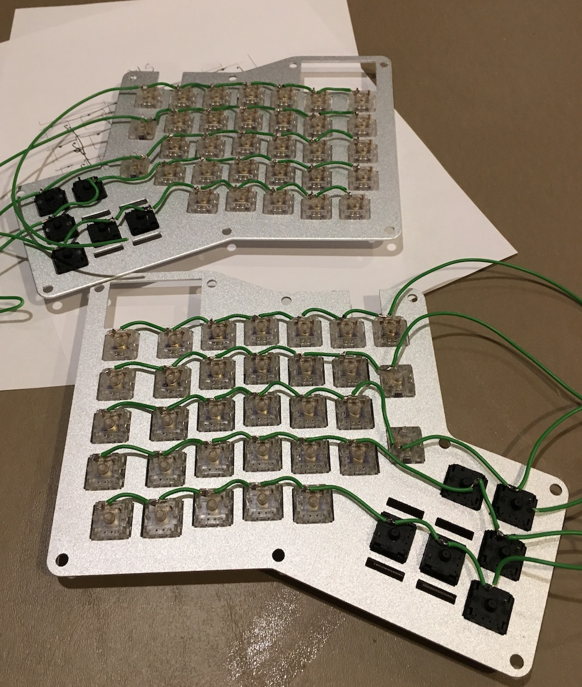
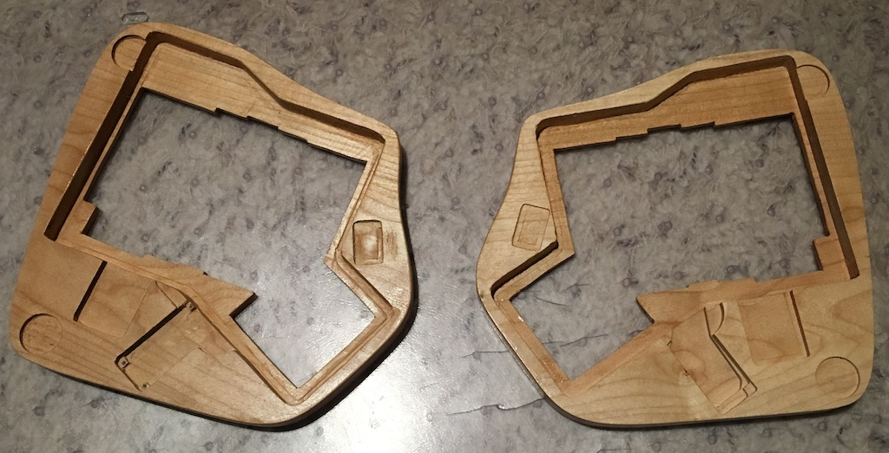
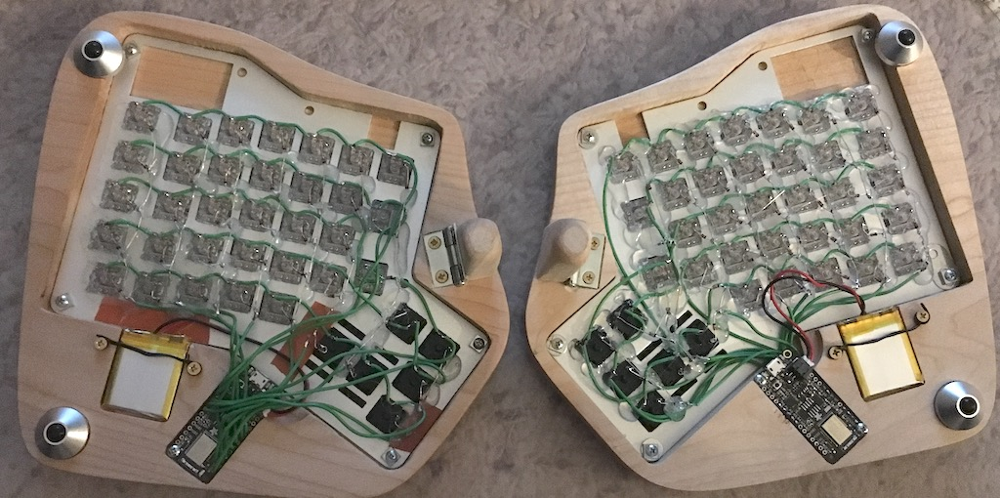
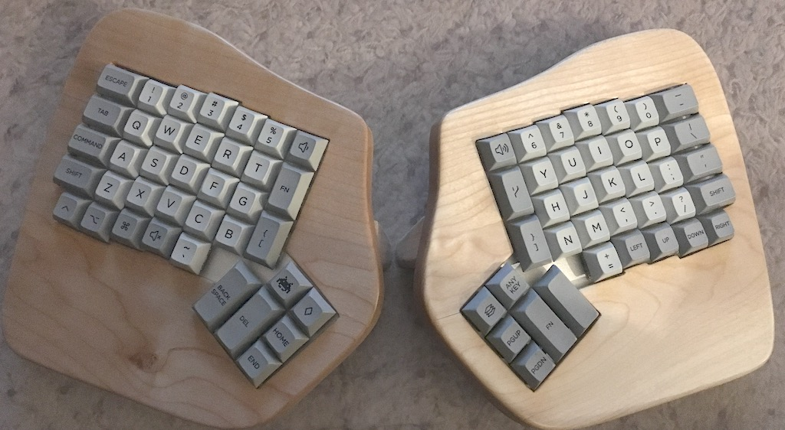

# ErgoBlue

Stuff for a fully wireless ErgoDox based on a
[Gist](https://gist.github.com/wez/b30683a4dfa329b86b9e0a2811a8c593) from the
fabulous Wez Furlong. If you read his Gist, he explains some of this. I'm going
to document what I'm doing as I go.

This is my first time doing anything real with Arduino or low level electronics
at all, so some of this stuff will be absurdly more detailed that it probably
needs to be, but I'm also an experienced software developer, so I'll gloss over
a bunch of stuff that seems simple to me (but may not be to you, dear reader).
Apologies in advance...

## Shopping List
1. **2 [AdaFruit feather nRF52](https://www.adafruit.com/product/3406)'s.**
1. **2 [LiPo batteries](https://www.adafruit.com/product/328) to drive the
wireless modules.** I bought 500 mAh LiPo batteries, because I'm hoping they
will last long enough for me to not have to charge very frequently. I'm a bit of
an idiot, because I didn't realize that they had 2500 mAh LiPo batteries. They
would be better...
1. **A couple of ErgoDox keyboard plates.** I purchased a spare ErgoDox Infinity
from MassDrop a while back (when they were still selling them), just to have
around in case either my home or work keyboard died. I find all the cords for
the ErgoDox *really* annoying, so I decided to grab the keyswitch plates and try
this out. I may wind up changing this keyboard to be a custom build instead. I
find the lack of a decent place to put an 'Arrow T' pretty irritating, as well,
so maybe sometime in the future I'll get as adventurous as Wez and make my own
custom keyboard plate.
1. **About 80 1n4148 'signaling' diodes.** (I bought 250, because they're
cheap). I understand, logically, what a diode is, but I have zero understanding
of the difference between a schottky diode, zener diode, or whatever. Everything
I've read says to just use 1n4148's, so I bought a bunch from DigiKey. I haven't
received them yet, so I'm just reading up on a bunch of stuff, and horsing
around with the AdaFruit devices.
1. **Key Switches.** [Cherry MX Clear](https://www.digikey.com/short/qq2p2d)'s
are what I've used, but I recently acquired a glob of
[Zealios](https://zealpc.net/collections/switches/products/zealio), which are
also firmer than Cherry Brown's, so I'm gonna try the Zealios Purple's on the
main keys, and the Clear's on the thumb clusters.
1. **Key Caps.** I have a bunch of these hanging around, because *I have a
problem*.
1. **A [MicroUSB Cable](http://a.co/31KmMeQ) or two.** Find one in a drawer somewhere. These things are everywhere, like Easter grass or Christmas Tree
tinsel. They multiply when out of sight, like a weird combination of rabbits,
and Weeping Angels.
1. **Some kind of case that works**. For me, I bought a chunk of maple and used
Autodesk Fusion360 to model a nice case with spots for the AdaFruit board and
the batteries, because I have a little CNC machine. Given that we don't have the
PCB layer from the original ErgoDox Infinity, I suspect you could do something with that case if you tried.

## Getting started
To use the AdaFruit devices, I had to download an older version (1.6.14) of the
Arduino IDE. The current version didn't want to let me follow AdaFruit's
directions to get their BSP (Base Software Package?) installed into Arduino.

I also had to jump through a number of hoops to get `nrfutil` functioning
properly.

>I really hate Python, in no small part because every time I cross anything
written in Python, it doesn't work properly on my Mac. This may be because the
Mac is configured by my employer, but fundamentally, there's just a whole pile
of crap to get through if you have a machine that you've tried to use Python on.
Those people might want to take a long hard look at Node. Oops. End Rant.

Once I had the code compiling, I tried installing the drivers for the AdaFruit's
but found myself having to try a variety of different things to get them working
correctly. I'm using a Mac to do all this. Perhaps it's easier on PC (but my PC
died a couple weeks ago, and I don't want to fix it yet...)

Once you've got the AdaFruit devices working, you upload the "sketch" to each
device. The right hand device is the 'master' and is the name of the keyboard
you'll see when you try to connect it to your computer (or iPad, or phone, or
whatever). The left hand devices is the 'slave' and all it does is communicate
the state of the keys to the master device.

## Designing the matrix
First, go and read about keyboard matrices. There are a number of well written
explanations for how they work. [Here's the one I found that I liked the
most.](http://pcbheaven.com/wikipages/How_Key_Matrices_Works/) The important
points (at least for me) are:
* Each key must be a unique combination of 'row' and 'column'
* You need to make sure to wire the diodes in parallel. If you wire them
serially, things may be unhappy (they may not, but parallel is the right way to
do this.

It has occurred to me that I might be able to cannibalize the ErgoDox PCB's for
some/all of the wiring, but that just seems like a pain, and I'm not ready to
destroy one yet. (Update: I could totally see myself destroying one now, but I
think I'm going to try using my CNC to make a PCB for a future evolution of this
project.)

I grabbed the DXF for the ErgoDox plate and printed a few out to try to draw a
key matrix I was happy with. First, I drew a plain matrix, like so:

As you can see, I'm a terrible artist, and also screwed up a couple things, but
erasers are helpful. Maybe I'll turn into into something less hand-drawn in the
future. Probably not.

Once I had a matrix that made sense to my brain, I grabbed switches, stuck 'em
in the switch plate, and looked at where the connections go. Based on that, I
drew up a wiring diagram for each side:

Here's the right hand side:

And here's the left:

I know: I'm an artist. My talent is wasted managing a team of brilliant
engineers.

## Now, the work!

### Soldering

First, I stripped wires so they fit across the rows, then soldered them:

The diodes showed up last night, so I soldered them together on the left hand
side. I'm old and sitting down soldering for a lot time makes my back hurt, so
I've just finished up the left hand side (probably not the smartest, because the
right hand side is the master, here, so I think I have to mess with both chunks
of Wez's code now. Here's the left hand side all dioded (that's a word!) up.

### Case Design

I already had an AutoDesk Fusion360 project for my ErgoDox Infinity to build a
nice hardwood case. The ErgoDox I use at work is in a [black
limba](http://www.crosscuthardwoods.com/black-limba.html) case that looks quite
nice). Based on that, I've added carve-outs for the battery & AdaFruit in the
underside of the wrist rest. Time to spin up the CNC machine.

>I have an [E3 CNC from BobsCNC](https://www.bobscnc.com). They kit came with a
damanged piece, which they replaced quickly after a quick conversation on FB
Messenger. The device itself is capable, but it's clearly focused on simple
engraving kind of stuff. The router is a wee bit under powered, but the real
issue is that the gantry (look, Ma, official words!) is just not sturdy enough
to handle something more powerful, so it results in things taking a *long* time
to mill, because you have to go really slowly. And going slowly is frequently
*really* hard on both the stock, and the cutter. If I had it to do over again, I
think I'd go with an [X-Carve](https://www.inventables.com/technologies/x-carve)
or [Shapeoko](https://shop.carbide3d.com/collections/machines/shapeoko). I'm
going to wind up upgrading to something much nicer when I haven't purchased so
many other expensive things in a while. If I had either of the other two, I'm
guessing I probably wouldn't be upgrading for a much longer time. Though, I
think the E3 has more Z-Axis distance than either of the other two. Right now,
I'm either going to go with something *really* pricey, or just say something
like the [MillRightCNC Power
Route](https://www.millrightcnc.com/product-page/millright-cnc-power-route) is
all I'll ever need.

I grabbed a couple of chunks of maple from [Crosscut
Hardwoods](http://www.crosscuthardwoods.com/) in Seattle on the cheap, because
they only had to be about 9 inches square. This is a real advantage of a 2 piece
keyboard. You can use cheap scrap end-chunks of wood for the cases. I milled
them on my CNC and then spent a bunch of time widening the cavity for the switch
plate by hand (you'd think after my previous experience, I would have learned my
lesson, but I didn't). Next I screwed the switch plates into position. I started
with the right side, and realized that I didn't have enough space under the BLE
PCB for the wires, so on the left side, I remedied that situation.

The little cut-out above the thumb cluster is for a hinge to hold the leg. I
like my keyboard tented up a bit, but I use a keyboard drawer at home, so the
legs will fold down to allow the drawer to close up and hide the horror of my
messy desk.

I'll upload my Fusion360 project somewhere accessible if anyone asks (probably
not up here: I have no idea how well a f3d file versions...)

At this point, I trimmed & soldered the wires up (on top for the right side,
underneath for the left, which looks much better because of this) and then
screwed the AdaFruit board in place. I messed up at this point, crushing the
charging LED on the left side. It still appears to hold a charge, but the light
doesn't work anymore :(. I keep the batteries in place with just a little black
wire tie that you can find in a drawer or on a shelf, or where ever electronic
cables are sold. I was using #4 3/8" screws everywhere, though the heads are
bigger than necessary (thus causing the crushed LED). I predrilled everywhere
because maple is hard, and the case might crack if I didn't. After than I hot-glued the living crap of the thing. I still expect that pulling keycaps off risky (which I'm going to risk, anyway, because I prefer my XDA Canvas keycaps over the DSA Granite ones I put on this thing while still 'in development').

Here's a nice picture of it after all the 'hardware' parts of the project are complete. The only thing I haven't done is seal the little hinged legs.

And here's a top view:

### Software

I have some *seriously* wacky layering going on in my original ErgoDox firmware
(which you can check out in my KLL fork, if you feel like it) but I plan on
starting this out as a normal Mac keyboard layout, without doing too much else.
I modified Wez's software in a couple of core ways, thus far. The biggest thing
I did was to change the slave to just send the raw 6 bytes of data every time
something changes (5 bytes of matrix data, 1 byte of battery info). I don't
think I'll have to change *anything* on the left hand side now. I also really
hate doing anything significant with the preprocessor, so I might try to make
something a bit more C++-ish with the actual keymapping code.

Update: Hahaha. Wez clearly knew what he was doing, because sometimes that stupid 6 byte payload gets cut down to only about 4 bytes, thereby messing things up. I'll have to go back to just sending keycodes. I'd still like to try to report battery data for the left side. No matter: I've currently got a pretty much fully functional keyboard (without any of my fancy extras), so I'm going to call it a night (and a weekend). The code seems to work alright, though it might be just a tad laggy. No more wires on my desktop for my keyboard! W00t! (And yes, I noticed that I messed up the V and C keys, but my fingers know which is which, and I'm going to switch the keycaps with my old monstrosity anyway, so I'll fix that soon enough...)

## Future Plans

* Add an on/off switch to conserve battery (but only if it's worth while)
* Add an LED or two or three to indicate layer/mode stuff: There's a nice spot
  for it where the LCD screen went on the Infinity...
* Upload my Fusion360 project for the wood case

**Useful links**

* [Matt3o's writeup of the BrownFox, the precursor to my wonderful WhiteFox.](https://deskthority.net/workshop-f7/brownfox-step-by-step-t6050.html)

**AdaFruit links**
* [AdaFruit's Feather examples.](https://github.com/adafruit/Adafruit_nRF52_Arduino/tree/master/libraries/Bluefruit52Lib/examples)
* [AdaFruit's nRF52 Learning Guide.](https://learn.adafruit.com/bluefruit-nrf52-feather-learning-guide/)
* [AdaFruit nRF52 Pinout.](https://learn.adafruit.com/bluefruit-nrf52-feather-learning-guide/device-pinout)

## Next project
This has been super fun. Once I'm done with this project, I'm going to try to
make a fully custom keyboard with a PCB that I mill on my CNC, with a purple
heart hardwood case. The primary complaint I have about my ErgoDox is the lack
of a decent place to put a set of arrow keys. I'm going to try to address that
and maybe shrink the thumb cluster and remove the extra index-finger row. Wish
me luck!
